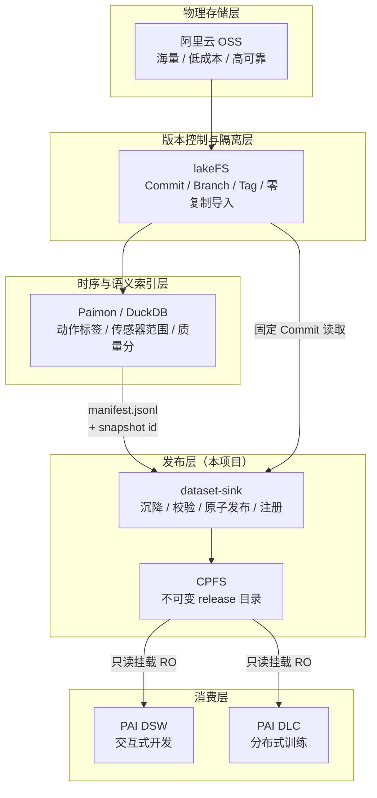
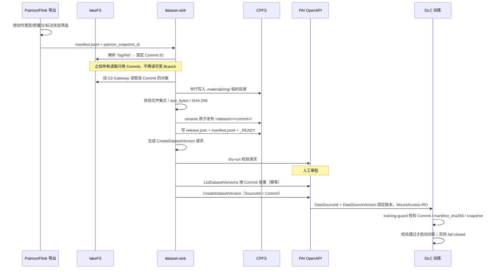
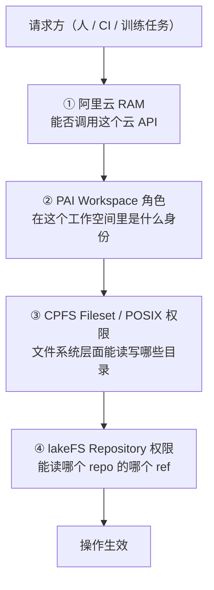

# 整体架构

本文描述 **lakeFS → CPFS Dataset Sink** 的完整架构：它在数据平台里占据的位置、数据如何流动、发布协议如何保证不可变、四套授权面如何叠加、以及 CI/CD 与 Terraform 如何交付这一切。

相关文档：[权限模型](permissions.md)｜[CI/CD](cicd.md)｜[运维手册](runbook.md)｜[使用入门](onboarding.md)

---

## 1. 项目定位

这个项目**只解决一件事：数据集的发布边界**。

它不替代 lakeFS 做版本控制，不替代 OSS 做存储，不替代 Paimon 做语义索引。它把「一个 lakeFS Commit」翻译成「一个 PAI 能只读挂载的、不可变的、可校验的 CPFS 目录」，并且让这个翻译过程可审计、可幂等重放、无法被绕过。

要立的规矩是：

> **任何投喂给训练的数据集，必须对应 lakeFS 上的一个 Commit Hash；严禁裸读 OSS 根目录，严禁挂载可变 Branch 或 `latest`。**

`training-guard` 就是这条规矩的技术强制点——它在训练进程启动前 fail-closed，而不是靠流程约定。

### 为什么不让 PAI 直读 OSS

| 方案 | 问题 |
|---|---|
| DLC/DSW 直读 OSS | 对象存储的元数据延迟和小文件吞吐撑不住 GPU DataLoader；每个 epoch 重复付出网络开销 |
| 挂载 lakeFS S3 Gateway | Gateway 成为训练期间的关键路径与单点；吞吐受限于 Gateway 实例 |
| 挂载可变 Branch | 训练中数据可能变化，实验不可复现 |
| **沉降到 CPFS 后只读挂载**（本项目） | 一次沉降、多次训练；POSIX 语义 + 并行文件系统吞吐；目录不可变，实验可复现 |

沉降是**一次性成本换重复收益**：付一次拷贝和校验，换来多个训练任务的高吞吐读取和确定的版本语义。

---

## 2. 分层架构



每一层的边界是刻意的：

- **OSS 只负责存字节**，不承载语义。
- **lakeFS 是唯一的版本真相**。Commit ID 是贯穿全链路的关联键，会出现在 `release.json`、`_READY`、PAI Dataset Version 的 `SourceId` 和 Label、以及 DLC Job 的环境变量里。
- **Paimon 负责「挑哪些数据」**，输出是一份 Manifest（JSONL）+ 一个 Snapshot ID。它决定数据集的内容组成，但不负责搬运。
- **dataset-sink 负责「搬运 + 封印」**，输出是一个不可变目录和一个 PAI Dataset Version。
- **PAI 只消费已封印的版本**，没有能力回头改写数据。

---

## 3. 端到端数据流



### 两种沉降模式

代码支持两条路径，取决于数据当前在哪里：

**`materialize`** —— 数据在 lakeFS/OSS，需要拷贝：

```
lakeFS Commit → 并行读取 → CPFS .materializing/ → 校验 → rename 发布
```

**`certify`** —— 数据已经在 CPFS Staging（采集/预处理直接落 CPFS），零复制：

```
CPFS staging/ → 全量校验（文件集合 + size + SHA-256）→ 同文件系统内 rename 发布
```

`certify` 是关键优化：同一个 CPFS 文件系统内的 `rename` 是原子元数据操作，不产生任何数据拷贝。对 TB 级数据集，这把发布时间从小时级降到秒级。代价是要求 Staging 目录内部已经按 Manifest 的 `target_path` 布局组织好。

---

## 4. 发布协议

CPFS 上的目录布局就是协议本身：

```
/mnt/cpfs/datasets/
├── .locks/                       # 进程锁，防止并发沉降同一 commit
├── .materializing/               # 临时目录，未完成的沉降只存在于此
└── robotics/                     # <dataset>
    └── 6f2b7c91c2/               # <lakeFS commit> —— 不可变
        ├── shards/               # 数据文件，按 manifest 的 target_path 布局
        ├── manifest.jsonl        # 内容清单（随发布固化）
        ├── release.json          # 发布元数据
        └── _READY                # 完成标记，最后写入
```

四条不可协商的规则：

1. **目录名是 Commit ID**，不是 Tag、不是 Branch、不是 `latest`、不是日期。
2. **`_READY` 最后写入**。没有 `_READY` 的目录一律视为未完成，消费方必须拒绝。
3. **已发布目录不可改写**。同一 Commit 重复沉降是幂等 no-op；同一 Commit 携带不同 Manifest 则报 `ReleaseConflictError` 而不是覆盖。
4. **PAI 只能挂载 `<dataset>/<commit>/`**，不能挂载 `.materializing`、`.locks` 或数据集根目录。

`release.json` 承载关联键，把四个系统的坐标钉在一起：

| 字段 | 作用 |
|---|---|
| `commit_id` | lakeFS 版本真相 |
| `repository` / `lakefs_tag` | 人可读的来源 |
| `manifest_sha256` | 内容清单指纹，training-guard 的核心校验项 |
| `paimon_snapshot_id` | 语义层坐标，回答「这批数据是按什么规则挑的」 |
| 文件数 / 总字节 | 快速一致性检查 |

这份元数据向下传递到 PAI Dataset Version 的 `SourceId` 和 `Labels`（`lakefs_commit`、`manifest_sha256`），再传递到 DLC Job 的 `CustomEnvs`，最后被 `training-guard` 在训练容器内重新校验一遍。**同一个指纹在四个系统里被独立记录并交叉验证**，任何一环被篡改或错配都会在训练启动前暴露。

---

## 5. 代码结构与职责

```
src/dataset_sink/
├── cli.py             251 行  6 个子命令的参数解析与编排
├── materializer.py    369 行  核心：并行沉降、锁、原子发布、certify、verify
├── aliyun_cli.py      164 行  PAI 注册（默认 dry-run、按 Commit 幂等查重）
├── manifest.py        119 行  JSONL Manifest 解析与校验
├── sources.py          68 行  源适配器：LakeFSS3SourceReader / LocalSourceReader
├── pai.py              66 行  构造 CreateDatasetVersion 请求体
├── training_guard.py   40 行  训练启动门禁（fail-closed）
├── lakefs_refs.py      32 行  Tag/Branch/Ref → 固定 Commit ID
└── errors.py           19 行  DatasetSinkError / ReleaseConflictError
```

六个子命令对应发布链路的六个动作：

| 命令 | 职责 | 执行身份 |
|---|---|---|
| `materialize` | 从 lakeFS 拷贝并发布 | `DatasetMaterializerRole` |
| `certify` | 从 CPFS Staging 零复制发布 | `DatasetMaterializerRole` |
| `verify` | 校验 release（`--deep` 重算全部哈希） | 任意只读身份 |
| `pai-request` | 生成 CreateDatasetVersion 请求 JSON | 无需云权限 |
| `register-pai` | 调 PAI OpenAPI 注册版本 | `DatasetRegisterRole` |
| `training-guard` | 训练容器内校验挂载版本 | `TrainingRuntimeRole` |

两个刻意的设计：

- **`pai-request` 和 `register-pai` 分开。** 前者纯本地计算、无云权限、输出可审阅的 JSON；后者才需要凭证。这让「生成什么请求」和「谁有权发这个请求」成为两个独立的、可分别审批的关注点。
- **`register-pai` 默认 dry-run。** 只有显式 `--execute` 才真正改动 PAI，且执行前先 `ListDatasetVersions` 按 Commit 查重。同一 Commit 已注册则返回 `EXISTS` 而非重复创建；若已存在版本的 `manifest_sha256` 与本次不一致，抛 `ReleaseConflictError` 拒绝执行。

CPFS 挂载路径与 CPFS 文件系统内部路径是**两个不同的坐标**，因此 `pai-request` 把它们分开传：`release_dir` 是执行机上的挂载视角（如 `/mnt/cpfs/datasets/robotics/<commit>`），`--filesystem-path` 是 PAI OpenAPI 需要的文件系统内部视角（如 `/datasets/robotics/<commit>`）。混淆这两者是接入期最常见的错误。

---

## 6. 四套授权面

**这是整个架构里最容易出错的部分。** 一次操作要成功，相关的每一层都必须放行；任意一层拒绝就失败。它们互不替代：



| 授权面 | 管什么 | 不管什么 |
|---|---|---|
| ① RAM | 身份、登录、云 API 调用、OSS/NAS/VPC 资源 | 工作空间内的算法权限细分 |
| ② PAI Workspace 角色 | 成员、训练作业、模型、数据集、流水线 | 文件系统里的实际可见范围 |
| ③ CPFS Fileset / POSIX | 目录级读写、UID/GID 映射 | 能否提交作业 |
| ④ lakeFS | Repository / ref 级读写 | 阿里云侧任何权限 |

有效权限是交集，且显式 Deny 优先：

```
有效权限 = RAM ∩ PAI Workspace 角色 ∩ CPFS 文件系统权限 ∩ lakeFS 权限
```

两个典型的排查陷阱：

- **RAM 权限还在、PAI 成员被移除** → 用户能登录 PAI，但看不到目标工作空间。
- **PAI 成员还在、RAM 授权被撤** → 用户在成员列表里，但调 API 全部失败。

所以人员离职或退出项目时，RAM 授权和 PAI 成员关系必须**同时**撤销——这也是把两者放进同一个 Terraform PR 管理的理由。

一个重要的现实约束：PAI 的 `CreateDatasetVersion` / `ListDatasetVersions` 在官方 RAM 定义中是 `Resource: "*"`，**无法用 RAM Policy 限定到某个 Dataset ID**。因此「只能注册这一个数据集」必须靠 ② PAI Workspace 角色 + CI 环境审批来二次收敛，不能只靠 ①。这类「单层做不到、必须叠加」的情况正是四层模型存在的原因。

### 身份矩阵

| 身份 | 能做 | 明确不能做 |
|---|---|---|
| `DatasetMaterializerRole` | 读 lakeFS Gateway 固定 Commit；写 CPFS staging/release | 注册 PAI 版本、提交 GPU 训练、覆盖已发布目录 |
| `DatasetRegisterRole` | `ListDatasetVersions`、`CreateDatasetVersion` | 读裸 OSS、写 CPFS、提交 DLC |
| `DlcSubmitRole` | 提交绑定已审批 Dataset Version 的 DLC Job | 改写数据版本、读 lakeFS/OSS |
| `TrainingRuntimeRole` | 只读挂载某个 CPFS release；写独立 output/checkpoint | 访问 landing/lakeFS 后端桶、写训练集 |
| 研发 RAM 用户 | 在 Workspace 内使用已发布版本 | 取长期 lakeFS/OSS 密钥、直接改生产 release |

拆分原则：**沉降、注册、训练是三个不同的信任级别**。能写数据的不能注册版本，能注册版本的不能提交训练，能训练的不能碰训练集。任何一个身份泄露都不足以完成一次完整的数据污染。

详细策略见 [权限模型](permissions.md)。

---

## 7. 交付架构（Terraform + CI/CD）

### 三层 Terraform State

```
infra/
├── bootstrap/          本地 state · 管理员手工执行一次
│   ├── OSS state 桶（版本控制 + 加密 + 私有）
│   ├── Tablestore 锁表（terraform_state_lock）
│   ├── RAM OIDC Provider（GitHub Actions 信任锚）
│   └── 三个 Terraform CI 角色
│
├── modules/            可复用模块
│   ├── ci-oidc-role/           参数化 OIDC 信任角色
│   ├── dataset-sink-roles/     5 个业务身份
│   └── pai-workspace-access/   Workspace 成员与角色
│
└── envs/
    ├── dev/{platform,access}/
    └── prod/{platform,access}/
```

分层依据是**变更频率 × 破坏半径**，而不是资源类型：

| 层 | 内容 | 频率 | 审批 |
|---|---|---|---|
| `bootstrap` | State 后端、OIDC 信任锚、CI 角色 | 近乎不变 | 管理员手工，本地 state |
| `platform` | VPC / OSS / CPFS / PAI Workspace / Dataset | 低频 | 生产 Environment 审批 |
| `access` | RAM Policy / RAM 角色 / Workspace 成员 | 中频但最敏感 | 独立流水线 + 双人审批 |

`bootstrap` 必须用本地 state，否则会陷入「State 桶要靠 Terraform 建，Terraform 要先有 State 桶」的自举死锁。

`platform` 和 `access` 必须分开 State：权限变更远比基础设施变更敏感，需要不同的审批人、不同的角色、不同的变更节奏。混在一起会导致「改一个 tag 顺手带上了一次提权」。

### 防提权设计

`TerraformAccessApplyRole` 是管理 RAM Policy 的角色。如果它同时能修改自己的 Policy，它就具备无限提权能力。因此：

- `TerraformPlatformApplyRole` 管基础设施，**不能**改 RAM。
- `TerraformAccessApplyRole` 管 RAM，**不能**改自己的信任策略和 Policy。
- 两者的信任策略都由 `bootstrap` 层管理，而 `bootstrap` 只有管理员能跑。

### 两条流水线

**基础设施流水线**（`infra/**` 变更触发）：

```
PR → OIDC 假设 TerraformPlanRole（只读）
   → fmt / validate / plan -out=tfplan
   → tfplan 上传为 artifact + 评论到 PR
   → 代码评审
合并 main → 下载同一个 tfplan
   → GitHub Environment 人工审批
   → 按变更路径假设 Platform 或 Access Apply Role
   → apply 该 tfplan
```

关键点：**apply 消费的是 plan 阶段产出的同一个 tfplan 文件**，不重新 plan。这保证审批时看到的变更和实际执行的变更逐字节一致——否则审批只是仪式。

**数据集发布流水线**（数据变更触发）：

```
构建镜像 → ACR
  → [DatasetMaterializerRole]  materialize / certify
  → [任意只读]                  verify --deep
  → [无云权限]                  pai-request
  → [DatasetRegisterRole]       register-pai（dry-run）
  → 人工审批
  → [DatasetRegisterRole]       register-pai --execute
  → [DlcSubmitRole]             提交冒烟 DLC Job
```

每一步换一个 RAM 角色，对应身份矩阵。这不是形式主义：流水线本身成为权限边界的执行者，单个步骤被攻破也无法横向移动到下一步。

### 为什么 Terraform 不管模型发布

Terraform 管低频稳定资源（Workspace、网络、存储、角色、成员）；训练任务、模型版本、镜像 tag 属于高频变化，不进 Terraform State。

原因是 State 的语义：Terraform State 描述「应该存在什么」，适合收敛型资源。训练任务是一次性事件，模型版本是追加型序列——把它们塞进 State 会导致 State 无限膨胀、plan 噪音淹没真实变更、且 `terraform destroy` 语义荒谬。高频发布交给流水线 + PAI OpenAPI（对 ACK 场景则是 Helm/Argo CD）。

---

## 8. 环境实况与差距

2026-08-02 对账号 `1339279783371949`（`wuji-ens-test@rd-cbawja.aliyunid.com`）的只读探测结果：

| 项目 | 实际 | 目标 | 差距 |
|---|---|---|---|
| 当前登录身份 | 主账号 root | 专用 RAM 用户 / OIDC 角色 | **必须整改**，root 不应用于日常和 Terraform |
| PAI Workspace | `617398` / `pai_7djc6it7is9uk07t4f` @ cn-hangzhou | dev / prod 双 Workspace | 现有的 import，另建 prod |
| Workspace 成员 | 1 条：root 自己，挂 Owner+Admin+AlgoDeveloper | 按角色分配的多成员 | import 后逐步收敛 |
| PAI Dataset | 0 个 | 每个数据集一个 | 需新建（`register-pai` 的前提） |
| 项目 RAM 角色 | 0 个 | 5 个业务 + 3 个 CI | 全部新建 |
| RAM OIDC Provider | 0 个 | 1 个（GitHub Actions） | 新建 |
| CPFS / NAS | **服务未开通**（`User.Disabled`） | 至少一个 CPFS 文件系统 | **最大阻塞点** |
| OSS | PAI 默认桶 + `wuji-product` | state 桶 + 数据集桶 | 新建 |
| lakeFS | 未部署 | 内网 API + S3 Gateway | 待部署 |

**当前最大阻塞：CPFS 服务未开通。** 沉降目标不存在，`materialize` / `certify` 在真实环境无法运行。因此 Terraform 里 CPFS 相关资源用 `var.enable_cpfs`（默认 `false`）gate 住——保证在服务开通前 `plan` 仍然可用，开通后单点切换。

**第二个阻塞：GitHub 托管 runner 到不了 VPC 内的 CPFS。** `materialize` 需要挂载 CPFS，只能跑在自托管 runner 或 ACK Job 上。发布流水线中该步骤先加守卫占位，避免误触发。

另有一个已踩到的坑：`aliyun` CLI profile 默认 region 是 `cn-shanghai`，而实际资源在 `cn-hangzhou`；且 `aiworkspace` 产品需要显式 `--endpoint`。所有脚本一律显式带 `--region` 和 `--endpoint`。

---

## 9. 关键设计决策汇总

| 决策 | 理由 | 代价 |
|---|---|---|
| 沉降到 CPFS 而非直读 OSS | GPU DataLoader 吞吐、POSIX 语义、版本可复现 | 一次性拷贝成本与额外存储 |
| 目录名用 Commit ID | 不可变、可复现、可交叉验证 | 人不易读，需靠 `release.json` 和 Tag 辅助 |
| `_READY` 最后写入 | 部分失败的沉降不会被误消费 | 消费方必须检查，不能只看目录存在 |
| `certify` 零复制路径 | TB 级数据集发布从小时降到秒 | 要求 Staging 预先按 `target_path` 布局 |
| `register-pai` 默认 dry-run | 改动 PAI 必须显式且可预览 | 多一步操作 |
| 按 Commit 幂等查重 | 重放安全，重复执行不产生重复版本 | 每次 execute 多一次 List 调用 |
| `pai-request` 与 `register-pai` 分离 | 请求内容与执行权限解耦，可分别审批 | 多一个中间产物 |
| plan/apply 拆 job 复用同一 tfplan | 审批内容 == 执行内容 | 需要 artifact 传递 |
| platform / access 双 State | 权限变更独立审批、独立节奏 | 两次 apply，跨层引用需 output |
| Terraform 不管模型发布 | State 语义不适合高频追加型资源 | 需另一条流水线 |
| 训练门禁在容器内校验 | 强制点靠代码而非流程约定 | 每个训练镜像都要装这个 CLI |

---

## 10. 已知边界

- **RAM 标签鉴权不是全服务支持。** `acs:RequestTag` / `acs:ResourceTag` 条件需逐服务验证，不支持的服务只能靠资源 ARN 或独立账号隔离。
- **PAI 数据集 API 的 RAM 粒度是 `Resource: "*"`。** 见第 6 节，必须靠 Workspace 角色 + 审批叠加。
- **CPFS 的实际可见范围由文件系统决定。** RAM 只回答「能否提交作业」，不能替代 Fileset 和 POSIX 权限。
- **Provider schema 未能在线核对。** 本环境的 `registry.terraform.io` 被网络策略拦截，Terraform 资源名以 `terraform validate` 的实际结果为准；个别资源可能需退化为 `aliyun` CLI + `import`。
- **单账号隔离弱于多账号。** 当前 dev/prod 靠 Workspace、OSS 前缀、State、RAM 角色和标签隔离；条件允许时应升级为阿里云资源目录下的独立账号。
