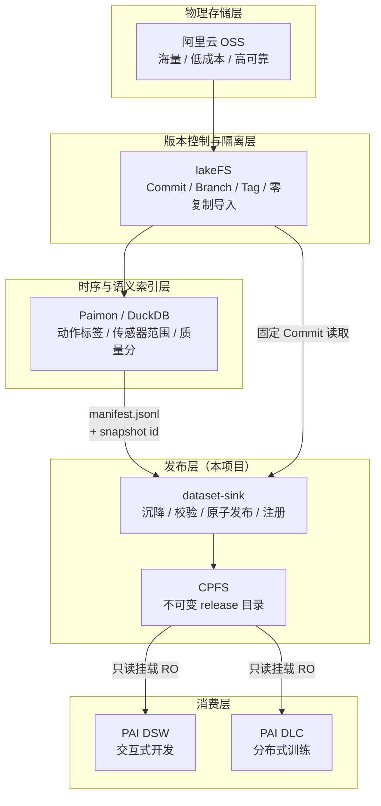
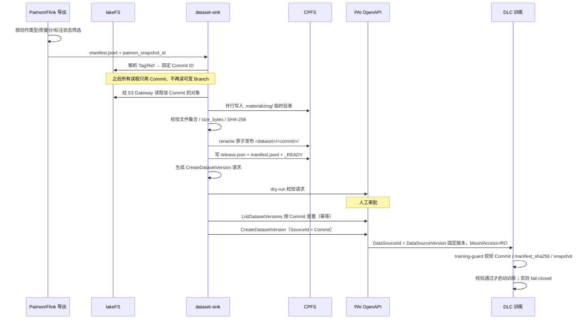
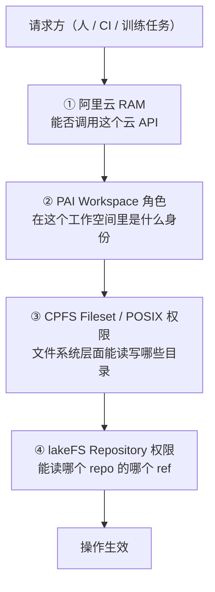

# 整体架构

本文描述 **lakeFS → CPFS Dataset Sink** 的完整架构：它在数据平台里占据的位置、数据如何流动、发布协议如何保证不可变、四套授权面如何叠加、以及 CI/CD 与 Terraform 如何交付这一切。

相关文档：[权限模型](permissions.md)｜[CI/CD](cicd.md)｜[运维手册](runbook.md)｜[使用入门](onboarding.md)

---

## 1. 项目定位

这个项目**只解决一件事：数据集的发布边界**。

它不替代 lakeFS 做版本控制，不替代 OSS 做存储，不替代 Paimon 做语义索引。它把「一个 lakeFS Commit」翻译成「一个 PAI 能只读挂载的、不可变的、可校验的 CPFS 目录」，并且让这个翻译过程可审计、可幂等重放、无法被绕过。

要立的规矩是：

> **任何投喂给训练的数据集，必须对应 lakeFS 上的一个 Commit Hash；严禁裸读 OSS 根目录，严禁挂载可变 Branch 或 `latest`。**

`training-guard` 就是这条规矩的技术强制点——它在训练进程启动前 fail-closed，而不是靠流程约定。

### 为什么不让 PAI 直读 OSS

| 方案 | 问题 |
|---|---|
| DLC/DSW 直读 OSS | 对象存储的元数据延迟和小文件吞吐撑不住 GPU DataLoader；每个 epoch 重复付出网络开销 |
| 挂载 lakeFS S3 Gateway | Gateway 成为训练期间的关键路径与单点；吞吐受限于 Gateway 实例 |
| 挂载可变 Branch | 训练中数据可能变化，实验不可复现 |
| **沉降到 CPFS 后只读挂载**（本项目） | 一次沉降、多次训练；POSIX 语义 + 并行文件系统吞吐；目录不可变，实验可复现 |

沉降是**一次性成本换重复收益**：付一次拷贝和校验，换来多个训练任务的高吞吐读取和确定的版本语义。

---

## 2. 分层架构



每一层的边界是刻意的：

- **OSS 只负责存字节**，不承载语义。
- **lakeFS 是唯一的版本真相**。Commit ID 是贯穿全链路的关联键，会出现在 `release.json`、`_READY`、PAI Dataset Version 的 `SourceId` 和 Label、以及 DLC Job 的环境变量里。
- **Paimon 负责「挑哪些数据」**，输出是一份 Manifest（JSONL）+ 一个 Snapshot ID。它决定数据集的内容组成，但不负责搬运。
- **dataset-sink 负责「搬运 + 封印」**，输出是一个不可变目录和一个 PAI Dataset Version。
- **PAI 只消费已封印的版本**，没有能力回头改写数据。

---

## 3. 端到端数据流



### CPFS 上处理完的新数据怎么进来

用户在 CPFS 上预处理产出的数据没有 Commit，而整套协议要求必须有。补齐这一段的是
三个命令：

```
CPFS staging（已按 target_path 布局）
   │  scan     并行算 size + SHA-256 → manifest.jsonl
   │           严格：有 .DS_Store/_READY 之类立刻失败（否则会在 certify 才撞上）
   ▼
   │  archive  归档到对象存储，幂等可续传，单遍 IO 完成校验
   ▼
   │  commit   lakeFS 零拷贝 import → Commit（+ Tag）
   ▼          只读对象元数据，不搬数据
lakeFS Commit  →  certify 在 CPFS 内 rename 发布
```

**为什么不能跳过归档直接在 CPFS 上发布**：CPFS 是热存储不是归档层（容量有限、
按容量计费、通常无跨区冗余），而 Commit 必须指向持久的字节位置。Commit 指向 CPFS
的话，release 目录一旦被淘汰就成了悬空引用——版本记录还在，数据没了。

所以整条链路里字节只被真正搬运一次（CPFS → 对象存储）：`archive` 是唯一的数据搬运，
`commit` 只读元数据，`certify` 只做 rename。

### 存量数据已经在对象存储上怎么办

这是最常见的起点，也是**最省事**的一条路：什么都不用搬。

```
现有 OSS 前缀（不动）
   │  scan-oss   列举 + 算 SHA-256 → manifest.jsonl
   │             只读，不写不删；对象一个字节都不动
   ▼
   │  commit     lakeFS 零拷贝 import → Commit（+ Tag）
   ▼             只记录对象的物理地址
lakeFS Commit
   │  materialize  按 Commit 拷到 CPFS 供训练读
   ▼
CPFS release
```

对比三条入口：

| 起点 | 命令 | 搬多少字节 |
|---|---|---|
| 存量数据在 OSS | `scan-oss` → `commit` → `materialize` | 只有最后一步 OSS→CPFS；建 Commit **零搬运** |
| 新数据在 CPFS | `scan` → `archive` → `commit` → `certify` | 一次 CPFS→OSS；发布是 rename |
| 数据已在 lakeFS | `materialize` | 一次 OSS→CPFS |

三条路里，**`archive` 只出现在中间那条**。存量 OSS 数据不需要归档，因为归档的目的
就是把字节放到持久位置上，而它们已经在那儿了。

#### 两个必须知道的后果

**一、import 之后原前缀就是只读区。** 零拷贝的含义是 Commit 只记录对象的物理地址，
字节仍然只有原处那一份。删掉或覆盖其中的对象，等于让已发布的 Commit 悬空——版本
记录还在，数据没了，而且**当时不会有任何东西报错**，要等到下一次 materialize 或
`verify --deep` 才暴露。所以这些前缀要登记进 `imported_data_prefixes`，Terraform
会对五个身份统一 Deny 写入与删除。RAM 只能约束本项目管理的身份，真正的兜底是桶级
Policy + 版本控制 + 合规保留策略。

**二、SHA-256 只能靠读一遍算出来。** 对象存储只提供 size 和 ETag（ETag 是 MD5，
分片上传时连 MD5 都不是），拿不到 SHA-256。`scan-oss` 默认完整读一遍来算，代价是
一次全量读。可以用 `--no-digest` 跳过，但那样发布出来的 release 会**永久**失去内容
校验能力（`verify --deep` 和 `training-guard --deep` 退化成只比大小），因为 manifest
随发布固化，事后补不上。所以 `--no-digest` 只适合先摸清前缀里有什么。

#### 两个坐标系

`scan-oss` 和 `commit` 的 `--destination` 必须填同一个值。manifest 里两个字段指的是
不同坐标系：

| 字段 | 含义 | 例 |
|---|---|---|
| `target_path` | release 目录内的相对路径 | `shards/a.bin` |
| `source_key` | **Commit 内**的路径 | `datasets/robotics/shards/a.bin` |

import 把 `prefix` 下的对象放到 Commit 的 `destination` 下面，而 `materialize` 从
lakeFS S3 Gateway 取对象用的键是 `<commit>/<source_key>`。填错的后果是 materialize
全量 404，而那时 Commit 和 Tag 都已经建好了。`commit` 会在建 Commit 之前比对
manifest 与 destination，把这个错误挡在前面。

### 两种沉降模式

数据已经有 Commit 之后，取决于它在哪里：

**`materialize`** —— 数据在 lakeFS/OSS，需要拷贝：

```
lakeFS Commit → 并行读取 → CPFS .materializing/ → 校验 → rename 发布
```

**`certify`** —— 数据已经在 CPFS Staging（采集/预处理直接落 CPFS），零复制：

```
CPFS staging/ → 全量校验（文件集合 + size + SHA-256）→ 同文件系统内 rename 发布
```

`certify` 是关键优化：同一个 CPFS 文件系统内的 `rename` 是原子元数据操作，不产生任何数据拷贝。对 TB 级数据集，这把发布时间从小时级降到秒级。代价是要求 Staging 目录内部已经按 Manifest 的 `target_path` 布局组织好。

---

## 4. 发布协议

CPFS 上的目录布局就是协议本身：

```
/mnt/cpfs/datasets/
├── .locks/                       # 进程锁，防止并发沉降同一 commit
├── .materializing/               # 临时目录，未完成的沉降只存在于此
├── .trash/                       # 回收时先原子改名到这里，再慢慢删
└── robotics/                     # <dataset>
    └── 6f2b7c91c2/               # <lakeFS commit> —— 不可变
        ├── shards/               # 数据文件，按 manifest 的 target_path 布局
        ├── manifest.jsonl        # 内容清单（随发布固化）
        ├── release.json          # 发布元数据
        ├── _READY                # 完成标记，最后写入
        └── .keep                 # 可选：人工置顶，回收永不触碰
```

四条不可协商的规则：

1. **目录名是 Commit ID**，不是 Tag、不是 Branch、不是 `latest`、不是日期。
2. **`_READY` 最后写入**。没有 `_READY` 的目录一律视为未完成，消费方必须拒绝。
3. **已发布目录不可改写**。同一 Commit 重复沉降是幂等 no-op；同一 Commit 携带不同 Manifest 则报 `ReleaseConflictError` 而不是覆盖。
4. **PAI 只能挂载 `<dataset>/<commit>/`**，不能挂载 `.materializing`、`.locks` 或数据集根目录。

`release.json` 承载关联键，把四个系统的坐标钉在一起：

| 字段 | 作用 |
|---|---|
| `commit_id` | lakeFS 版本真相 |
| `repository` / `lakefs_tag` | 人可读的来源 |
| `manifest_sha256` | 内容清单指纹，training-guard 的核心校验项 |
| `paimon_snapshot_id` | 语义层坐标，回答「这批数据是按什么规则挑的」 |
| 文件数 / 总字节 | 快速一致性检查 |

这份元数据向下传递到 PAI Dataset Version 的 `SourceId` 和 `Labels`（`lakefs_commit`、`manifest_sha256`），再传递到 DLC Job 的 `CustomEnvs`，最后被 `training-guard` 在训练容器内重新校验一遍。**同一个指纹在四个系统里被独立记录并交叉验证**，任何一环被篡改或错配都会在训练启动前暴露。

### OSS 与 CPFS 之间怎么搬字节

**用 CPFS 数据流动（DataFlow），不是应用层自己拷。**

| 动作 | 方向 | 是否释放空间 |
|---|---|---|
| 预热 `Import` | OSS 前缀 → CPFS 路径 | 否，OSS 那份还在 |
| 沉淀 `Export` | CPFS 路径 → OSS 前缀 | **否**，CPFS 那份还在 |
| `Evict` | 释放 CPFS 数据块，保留元数据 | **是，只有它释放空间** |

**预热和沉淀都是复制，不删源。**「沉淀」这个词容易让人以为数据被移走了——没有。
正确的配对是 `Export → Evict`：先确保源存储里有一份，再释放本地数据块。单独
Export 只增不减，单独 Evict 则要求数据本来就在源存储里。

#### 为什么按路径拉得动我们的数据

一般 lakeFS 的对象存在 blockstore 里是哈希地址（`.../data/<partition>/<random-id>`），
按路径根本拉不出 release 布局，数据流动就用不上。

但本项目建 Commit **一律走零拷贝 import**——对象从没被搬进 lakeFS 自己的命名空间，
物理地址就是原始的可读前缀：

| 入口 | 物理地址 |
|---|---|
| 存量数据 | 原 OSS 前缀 |
| `cpfs-ingest` | `archive` 写入的前缀 |

两者都是可读路径。这个前缀记在 Commit metadata 的 `object_store_uri` 里，
预热时就从它拉。

#### 数据流动替不掉什么

它只保证**字节到位**，不保证内容和 manifest 一致。所以预热之后仍然要走 `certify`：
全量比对文件集合、大小、SHA-256，通过了才 rename 发布。

换句话说，数据流动替掉的是「搬」，替不掉「验」和「封」。本项目剩下的职责正是后两者
加上版本语义与授权边界。

顺带一个实际收益：字节搬运不再需要执行者挂载 CPFS，只需要能调 `nas` API——
自托管 runner 的需求从「搬 TB 级数据」缩到「改几个文件名」。

### 回收：唯一被设计成可删的一层

CPFS release 只增不减，容量有限且按容量计费。写满之后 `materialize` 直接失败，
那时既发不了新版本，也不敢乱删。所以回收不是可选的运维动作，而是这一层能成立的
前提——第 3 节「按需沉降到训练所在的 VPC、用完回收」讲的就是这件事。

回收之所以**安全**，只靠一条前提：

> 删掉的 release 必须能重建。

而这条前提由发布协议本身保证：release 目录名是 Commit ID，Commit 指向对象存储里的
字节。所以只要 Commit 还在，随时可以重新 materialize 回来。`reclaim` 默认会去
lakeFS 核对 Commit 是否存在，**核对不了就一律不删**——宁可漏删，不可错删。

六道闸门，按「便宜的先跑」排序（一个注定要保留的 release 不该消耗一次远程调用）：

| 闸门 | 拦住什么 |
|---|---|
| `.keep` 标记 | 人工置顶的 release，永不触碰 |
| `_READY` 缺失 | 发布中断的残骸，默认不动（需 `--include-incomplete`） |
| 保留最近 N 个 | 保证不会把一个数据集清空 |
| 保护期 | 发布未满 N 天的不回收 |
| 占用探测 | 正在被训练任务挂载的 |
| **可重建性** | 确认不了能重建的，一律保留 |

**没接占用探测时，保护期是唯一挡在回收和运行中训练之间的东西**，所以默认 14 天，
不要随手调小。占用探测做成了可注入的接口，接上真实的 DLC 作业查询之后才谈得上
缩短保护期。

#### 两种策略，语义完全不同

回收有两种做法，它们**不是同一件事的两种实现**：

| | `hard-delete` | `cpfs-evict` |
|---|---|---|
| release 目录 | 消失 | **还在**，元数据保留 |
| PAI Dataset Version | 悬空，挂载会失败 | **仍然有效** |
| 再次训练 | 要重跑 `materialize` | **访问时按需从 OSS 加载** |
| 最坏情况 | 数据不可用 | 一次冷读的性能损失 |
| 适用范围 | 任何 POSIX 文件系统 | 需 CPFS 数据流动；**灵骏 BMCPFS 不支持 Evict** |

`cpfs-evict` 用的是 CPFS 数据流动的 `Evict` 任务（`DataType=Data`，只释放数据块、
保留元数据）。它释放的是**缓存**而不是数据，所以安全要求本该比硬删低得多——
但在真实环境验证之前，两者用同一套闸门。

三个前提，任一不满足就失败而不是降级：

1. release 路径必须落在某个已建好的 DataFlow 下面（Evict 的含义是「把缓存还给
   源存储」，没有源存储无从谈起）；
2. 文件系统必须支持 Evict（灵骏 BMCPFS 不支持）；
3. 传给 API 的是**文件系统内部路径**，不是挂载路径——和 `pai-request` 的
   `release_dir` / `--filesystem-path` 是同一个坑，靠 `--cpfs-mount-prefix` 换算。

**找不到 DataFlow 时绝不静默退化成硬删。** 那是最危险的失败模式：操作者以为
「只是释放了缓存」，实际目录已经没了。

`hard-delete` 的删除是「先原子改名进 `.trash`，再慢慢 rmtree」：

```
<dataset>/<commit>/  --rename-->  .trash/<dataset>/<commit>  --rmtree-->  ∅
        原子，一瞬间从命名空间消失            可能很慢，但已经不可见
```

`rename` 是原子的元数据操作，所以**不存在「删了一半的 release」被消费方看到的窗口**
——这跟 `_READY` 最后写入是同一个道理的反向应用。rmtree 中途被杀只会在 `.trash` 里
留下残骸，下次 `--sweep-trash` 接着扫。

删除前会拿**和 materialize / certify 同一把锁**，并在锁内重新核对前置条件：计划是在
锁外生成的，期间另一个进程完全可能正在往同一个 Commit 发布。rmtree 则放在锁外，
因为它慢，而那时目录已经不在命名空间里了，继续占锁只会挡住重新发布。

---

## 5. 代码结构与职责

```
src/dataset_sink/
├── ingest.py          806 行  接入版本体系：scan / scan-oss / archive / commit
├── reclaim.py         422 行  回收 CPFS release：盘点 / 计划 / 原子删除
├── cli.py             660 行  11 个子命令的参数解析与编排
├── materializer.py    372 行  核心：并行沉降、锁、原子发布、certify、verify
├── aliyun_cli.py      163 行  PAI 注册（默认 dry-run、按 Commit 幂等查重）
├── manifest.py        122 行  JSONL Manifest 解析与校验
├── sources.py          67 行  源适配器：LakeFSS3SourceReader / LocalSourceReader
├── pai.py              66 行  构造 CreateDatasetVersion 请求体
├── training_guard.py   34 行  训练启动门禁（fail-closed）
├── lakefs_refs.py      31 行  Tag/Branch/Ref → 固定 Commit ID
└── errors.py           18 行  DatasetSinkError / ReleaseConflictError
```

十一个子命令对应发布链路的十一个动作：

| 命令 | 职责 | 执行身份 |
|---|---|---|
| `scan` | 扫描 CPFS staging → manifest | 无需云权限 |
| `scan-oss` | 列举对象存储存量前缀 → manifest | 只读对象存储 |
| `archive` | staging → 对象存储（幂等可续传） | `DatasetMaterializerRole` |
| `commit` | 零拷贝 import → lakeFS Commit | 仅 lakeFS 凭证 |
| `materialize` | 从 lakeFS 拷贝并发布 | `DatasetMaterializerRole` |
| `certify` | 从 CPFS Staging 零复制发布 | `DatasetMaterializerRole` |
| `verify` | 校验 release（`--deep` 重算全部哈希） | 任意只读身份 |
| `reclaim` | 回收不再需要的 CPFS release（默认 dry-run） | `DatasetMaterializerRole` + lakeFS 只读 |
| `pai-request` | 生成 CreateDatasetVersion 请求 JSON | 无需云权限 |
| `register-pai` | 调 PAI OpenAPI 注册版本 | `DatasetRegisterRole` |
| `training-guard` | 训练容器内校验挂载版本 | `TrainingRuntimeRole` |

注意 `commit` 那一行：它是唯一一个**不需要任何阿里云身份**的写操作。建 Commit 只需要
lakeFS 凭证，不需要碰数据——不需要碰数据的步骤就不该有碰数据的能力。

两个刻意的设计：

- **`pai-request` 和 `register-pai` 分开。** 前者纯本地计算、无云权限、输出可审阅的 JSON；后者才需要凭证。这让「生成什么请求」和「谁有权发这个请求」成为两个独立的、可分别审批的关注点。
- **`register-pai` 默认 dry-run。** 只有显式 `--execute` 才真正改动 PAI，且执行前先 `ListDatasetVersions` 按 Commit 查重。同一 Commit 已注册则返回 `EXISTS` 而非重复创建；若已存在版本的 `manifest_sha256` 与本次不一致，抛 `ReleaseConflictError` 拒绝执行。

CPFS 挂载路径与 CPFS 文件系统内部路径是**两个不同的坐标**，因此 `pai-request` 把它们分开传：`release_dir` 是执行机上的挂载视角（如 `/mnt/cpfs/datasets/robotics/<commit>`），`--filesystem-path` 是 PAI OpenAPI 需要的文件系统内部视角（如 `/datasets/robotics/<commit>`）。混淆这两者是接入期最常见的错误。

---

## 6. 四套授权面

**这是整个架构里最容易出错的部分。** 一次操作要成功，相关的每一层都必须放行；任意一层拒绝就失败。它们互不替代：



| 授权面 | 管什么 | 不管什么 |
|---|---|---|
| ① RAM | 身份、登录、云 API 调用、OSS/NAS/VPC 资源 | 工作空间内的算法权限细分 |
| ② PAI Workspace 角色 | 成员、训练作业、模型、数据集、流水线 | 文件系统里的实际可见范围 |
| ③ CPFS Fileset / POSIX | 目录级读写、UID/GID 映射 | 能否提交作业 |
| ④ lakeFS | Repository / ref 级读写 | 阿里云侧任何权限 |

有效权限是交集，且显式 Deny 优先：

```
有效权限 = RAM ∩ PAI Workspace 角色 ∩ CPFS 文件系统权限 ∩ lakeFS 权限
```

两个典型的排查陷阱：

- **RAM 权限还在、PAI 成员被移除** → 用户能登录 PAI，但看不到目标工作空间。
- **PAI 成员还在、RAM 授权被撤** → 用户在成员列表里，但调 API 全部失败。

所以人员离职或退出项目时，RAM 授权和 PAI 成员关系必须**同时**撤销——这也是把两者放进同一个 Terraform PR 管理的理由。

一个重要的现实约束：PAI 的 `CreateDatasetVersion` / `ListDatasetVersions` 在官方 RAM 定义中是 `Resource: "*"`，**无法用 RAM Policy 限定到某个 Dataset ID**。因此「只能注册这一个数据集」必须靠 ② PAI Workspace 角色 + CI 环境审批来二次收敛，不能只靠 ①。这类「单层做不到、必须叠加」的情况正是四层模型存在的原因。

### 身份矩阵

| 身份 | 能做 | 明确不能做 |
|---|---|---|
| `DatasetMaterializerRole` | 读 lakeFS Gateway 固定 Commit；写 CPFS staging/release | 注册 PAI 版本、提交 GPU 训练、覆盖已发布目录 |
| `DatasetRegisterRole` | `ListDatasetVersions`、`CreateDatasetVersion` | 读裸 OSS、写 CPFS、提交 DLC |
| `DlcSubmitRole` | 提交绑定已审批 Dataset Version 的 DLC Job | 改写数据版本、读 lakeFS/OSS |
| `TrainingRuntimeRole` | 只读挂载某个 CPFS release；写独立 output/checkpoint | 访问 landing/lakeFS 后端桶、写训练集 |
| 研发 RAM 用户 | 在 Workspace 内使用已发布版本 | 取长期 lakeFS/OSS 密钥、直接改生产 release |

拆分原则：**沉降、注册、训练是三个不同的信任级别**。能写数据的不能注册版本，能注册版本的不能提交训练，能训练的不能碰训练集。任何一个身份泄露都不足以完成一次完整的数据污染。

详细策略见 [权限模型](permissions.md)。

---

## 7. 交付架构（Terraform + CI/CD）

### 三层 Terraform State

```
infra/
├── bootstrap/          本地 state · 管理员手工执行一次
│   ├── OSS state 桶（版本控制 + 加密 + 私有）
│   ├── Tablestore 锁表（terraform_state_lock）
│   ├── RAM OIDC Provider（GitHub Actions 信任锚）
│   └── 三个 Terraform CI 角色
│
├── modules/            可复用模块
│   ├── ci-oidc-role/           参数化 OIDC 信任角色
│   ├── dataset-sink-roles/     5 个业务身份
│   └── pai-workspace-access/   Workspace 成员与角色
│
└── envs/
    ├── dev/{platform,access}/
    └── prod/{platform,access}/
```

分层依据是**变更频率 × 破坏半径**，而不是资源类型：

| 层 | 内容 | 频率 | 审批 |
|---|---|---|---|
| `bootstrap` | State 后端、OIDC 信任锚、CI 角色 | 近乎不变 | 管理员手工，本地 state |
| `platform` | VPC / OSS / CPFS / PAI Workspace / Dataset | 低频 | 生产 Environment 审批 |
| `access` | RAM Policy / RAM 角色 / Workspace 成员 | 中频但最敏感 | 独立流水线 + 双人审批 |

`bootstrap` 必须用本地 state，否则会陷入「State 桶要靠 Terraform 建，Terraform 要先有 State 桶」的自举死锁。

`platform` 和 `access` 必须分开 State：权限变更远比基础设施变更敏感，需要不同的审批人、不同的角色、不同的变更节奏。混在一起会导致「改一个 tag 顺手带上了一次提权」。

### 防提权设计

`TerraformAccessApplyRole` 是管理 RAM Policy 的角色。如果它同时能修改自己的 Policy，它就具备无限提权能力。因此：

- `TerraformPlatformApplyRole` 管基础设施，**不能**改 RAM。
- `TerraformAccessApplyRole` 管 RAM，**不能**改自己的信任策略和 Policy。
- 两者的信任策略都由 `bootstrap` 层管理，而 `bootstrap` 只有管理员能跑。

### 两条流水线

**基础设施流水线**（`infra/**` 变更触发）：

```
PR → OIDC 假设 TerraformPlanRole（只读）
   → fmt / validate / plan -out=tfplan
   → tfplan 上传为 artifact + 评论到 PR
   → 代码评审
合并 main → 下载同一个 tfplan
   → GitHub Environment 人工审批
   → 按变更路径假设 Platform 或 Access Apply Role
   → apply 该 tfplan
```

关键点：**apply 消费的是 plan 阶段产出的同一个 tfplan 文件**，不重新 plan。这保证审批时看到的变更和实际执行的变更逐字节一致——否则审批只是仪式。

**数据集发布流水线**（数据变更触发）：

```
构建镜像 → ACR
  → [DatasetMaterializerRole]  materialize / certify
  → [任意只读]                  verify --deep
  → [无云权限]                  pai-request
  → [DatasetRegisterRole]       register-pai（dry-run）
  → 人工审批
  → [DatasetRegisterRole]       register-pai --execute
  → [DlcSubmitRole]             提交冒烟 DLC Job
```

每一步换一个 RAM 角色，对应身份矩阵。这不是形式主义：流水线本身成为权限边界的执行者，单个步骤被攻破也无法横向移动到下一步。

### 多地区

2026-08-02 实测发现账号里 **PAI Workspace 分布在两个地区**（`617398` @ cn-hangzhou、
`316328` @ ap-southeast-1），OSS 桶横跨三个地区。所以多地区不是假设，是现状。

**隔离边界是 VPC，不是地区。** CPFS 只能被自己 VPC 内的客户端挂载，同地区不同 VPC
一样看不见。所以「跨地区」只是「跨 VPC」里比较显眼的一种情况，真正要问的问题始终是
**训练任务跑在哪个 VPC**。

| 组件 | 作用域 | 后果 |
|---|---|---|
| RAM 角色 / 策略 | **账号全局** | 一份就够，不要按地区复制 |
| lakeFS Commit | **地区无关**（纯元数据 + 对象地址） | 同一个 Commit 在任何地方都指同一份数据 |
| OSS 桶 | 区域性 | 跨地区读要付流量费且慢 |
| CPFS 文件系统 | **绑定 VPC** | 跨 VPC / 跨地区都挂不上 |
| PAI Workspace / Dataset | 区域性 | 每个地区各注册一次 |

由此得出的模型——**不是每个地区常驻一份，而是按需迁移到训练所在的 VPC**：

```
        lakeFS Commit（唯一版本真相）
                 │
                 │  ← 需要换地区时：阿里云的数据迁移能力
                 │     （OSS 跨区域复制 / 在线迁移服务）搬一次
                 ▼
        训练所在 VPC 的 CPFS
        materialize 进来 → 训练 → 回收
```

CPFS release 是**为某次训练存在的热缓存**，不是常驻副本。哪个 VPC 要训练就往哪个
VPC 沉降，训练结束就回收——这跟第 4 节「CPFS 是可丢弃的热副本」是同一件事，
也正是回收机制存在的理由。

跨地区搬运是**平台能力，不是本项目的职责**。dataset-sink 不做跨区复制，它只负责
「从一个可达的对象存储位置沉降到一个可达的 CPFS」。字节怎么跨区到位，交给阿里云的
迁移服务。

#### 一个必须知道的后果：复制不会让 Commit 跟着走

lakeFS 的零拷贝 import 记录的是对象的**物理地址**。把 `oss://bucket-hz/...` 跨区
复制到 `oss://bucket-sg/...` 之后，Commit 仍然指向杭州那份——副本对 lakeFS 来说
根本不存在。

所以在另一个地区 materialize 同一个 Commit，读的仍然是原始位置。这是一次性成本
（之后训练读的是本地 CPFS），记在这一次沉降上。**不要为了就近读而对副本再 import
一次**：那会给同一份数据造出第二个 Commit ID，破坏「一个版本一个 Commit」的前提，
两边 `training-guard` 的指纹从此对不上，且不可逆。

### 为什么 Terraform 不管模型发布

Terraform 管低频稳定资源（Workspace、网络、存储、角色、成员）；训练任务、模型版本、镜像 tag 属于高频变化，不进 Terraform State。

原因是 State 的语义：Terraform State 描述「应该存在什么」，适合收敛型资源。训练任务是一次性事件，模型版本是追加型序列——把它们塞进 State 会导致 State 无限膨胀、plan 噪音淹没真实变更、且 `terraform destroy` 语义荒谬。高频发布交给流水线 + PAI OpenAPI（对 ACK 场景则是 Helm/Argo CD）。

---

## 8. 环境实况与差距

2026-08-02 对账号 `1339279783371949`（`wuji-ens-test@rd-cbawja.aliyunid.com`）的探测结果：

| 项目 | 实际 | 目标 | 差距 |
|---|---|---|---|
| 当前登录身份 | 主账号 root | 专用 RAM 用户 / OIDC 角色 | **必须整改**，root 不应用于日常和 Terraform |
| PAI Workspace | **两个地区各 1 个**：`617398` @ cn-hangzhou、`316328` @ ap-southeast-1，均 ENABLED | dev / prod 双 Workspace | 现有的 import；`platform` 层需按地区拆 state |
| Workspace 成员 | 1 条：root 自己，挂 Owner+Admin+AlgoDeveloper | 按角色分配的多成员 | import 后逐步收敛 |
| PAI Dataset API | **可用**（建/删/列版本已实测通过） | — | 无 |
| PAI Dataset | 0 个 | 每个数据集一个 | 需新建（`register-pai` 的前提） |
| 项目 RAM 角色 | 0 个 | 5 个业务 + 3 个 CI | 全部新建 |
| RAM OIDC Provider | 0 个 | 1 个（GitHub Actions） | 新建 |
| NAS / CPFS 服务 | **已开通**（不再 `User.Disabled`） | — | 无 |
| CPFS 文件系统 | **0 个** | 至少一个 | **最大阻塞点** |
| OSS | 3 个桶（cn-hangzhou / cn-shenzhen / ap-southeast-1），共 7 个对象，均为测试文件 | state 桶 + 数据集桶 | 真实数据在另一个账号 |
| VPC | cn-hangzhou 1 个；ap-southeast-1 **0 个** | 每个要跑 CPFS 的地区各一个 | CPFS 必须绑 VPC，新加坡侧要先建 |
| lakeFS | 未部署 | 内网 API + S3 Gateway | 待部署 |

**当前最大阻塞：没有 CPFS 文件系统。** 服务本身已开通，但一个文件系统都没建，所以沉降目标不存在。Terraform 里 CPFS 相关资源用 `var.enable_cpfs`（默认 `false`）gate 住——保证在文件系统就绪前 `plan` 仍然可用，就绪后单点切换。

### PAI Dataset 的实测结论

2026-08-02 用真实账号跑通了 `certify → verify --deep → pai-request → register-pai` 全链路（临时建了一个通用型 NAS，测完即删）：

| 验证项 | 结果 |
|---|---|
| `register-pai`（默认 dry-run） | `DRY_RUN`，不改动 PAI |
| `register-pai --execute` | `CREATED`，返回 `v4` |
| 重跑 `--execute`（幂等） | `EXISTS`，不重复创建，退出码 `0` |
| 同 Commit + 不同 `manifest_sha256` | 拒绝执行，退出码 `2` |

三条只有在真实 API 上才能确认的规则：

1. **建 Dataset 时 PAI 会自动创建 `v1`。** 所以流水线第一次注册拿到的是 `v2`，不是 `v1`。我们按 `SourceId`（lakeFS Commit）查重，而自动 `v1` 的 `SourceId` 是 `null`，不冲突。
2. **版本的 `DataSourceType` 必须与父 Dataset 一致**，否则报 `DataSourceType not match`。
3. **PAI 按 `DataSourceType` 分别校验 `Uri`，严格程度不同**：

   | 类型 | Uri | 校验强度 |
   |---|---|---|
   | `NAS` | `nas://<fsid>.<region>/<subpath>/` | 只校验格式——虚构的 fsid 也能建成功 |
   | `CPFS` | `nas://<cpfs-fsid>.<region>/<subpath>/` | **会校验文件系统真实存在**，形状正确的假 id 一律报 `Uri format error` |

   所以 CPFS 型 Dataset 在没有真实 CPFS 文件系统之前**无法创建**，这一段只能等文件系统就绪后联调。

   另外 `ListDatasetVersions` **必须传 `PageNumber`**，否则报 `MissingPageNumber`。

**第二个阻塞：GitHub 托管 runner 到不了 VPC 内的 CPFS。** `materialize` 需要挂载 CPFS，只能跑在自托管 runner 或 ACK Job 上。发布流水线中该步骤先加守卫占位，避免误触发。

另有一个已踩到的坑：`aliyun` CLI profile 默认 region 是 `cn-shanghai`，而实际资源在 `cn-hangzhou`；且 `aiworkspace` 产品需要显式 `--endpoint`。所有脚本一律显式带 `--region` 和 `--endpoint`。

---

## 9. 关键设计决策汇总

| 决策 | 理由 | 代价 |
|---|---|---|
| 沉降到 CPFS 而非直读 OSS | GPU DataLoader 吞吐、POSIX 语义、版本可复现 | 一次性拷贝成本与额外存储 |
| 目录名用 Commit ID | 不可变、可复现、可交叉验证 | 人不易读，需靠 `release.json` 和 Tag 辅助 |
| `_READY` 最后写入 | 部分失败的沉降不会被误消费 | 消费方必须检查，不能只看目录存在 |
| `certify` 零复制路径 | TB 级数据集发布从小时降到秒 | 要求 Staging 预先按 `target_path` 布局 |
| 存量 OSS 数据零拷贝 import | 不搬字节即可纳入版本体系 | 原前缀变成只读区，误删会让 Commit 悬空 |
| `scan-oss` 默认算 SHA-256 | 对象存储给不了 SHA-256，只能读一遍 | 一次全量读；`--no-digest` 省掉但永久失去深度校验 |
| `register-pai` 默认 dry-run | 改动 PAI 必须显式且可预览 | 多一步操作 |
| 按 Commit 幂等查重 | 重放安全，重复执行不产生重复版本 | 每次 execute 多一次 List 调用 |
| `pai-request` 与 `register-pai` 分离 | 请求内容与执行权限解耦，可分别审批 | 多一个中间产物 |
| plan/apply 拆 job 复用同一 tfplan | 审批内容 == 执行内容 | 需要 artifact 传递 |
| platform / access 双 State | 权限变更独立审批、独立节奏 | 两次 apply，跨层引用需 output |
| Terraform 不管模型发布 | State 语义不适合高频追加型资源 | 需另一条流水线 |
| `reclaim` 以「能否重建」为删除前提 | 删除只损失热缓存，不损失版本 | 需要 lakeFS 可达；确认不了就不删 |
| 训练门禁在容器内校验 | 强制点靠代码而非流程约定 | 每个训练镜像都要装这个 CLI |

---

## 10. 已知边界

- **RAM 标签鉴权不是全服务支持。** `acs:RequestTag` / `acs:ResourceTag` 条件需逐服务验证，不支持的服务只能靠资源 ARN 或独立账号隔离。
- **PAI 数据集 API 的 RAM 粒度是 `Resource: "*"`。** 见第 6 节，必须靠 Workspace 角色 + 审批叠加。
- **CPFS 的实际可见范围由文件系统决定。** RAM 只回答「能否提交作业」，不能替代 Fileset 和 POSIX 权限。
- **Provider schema 未能在线核对。** 本环境的 `registry.terraform.io` 被网络策略拦截，Terraform 资源名以 `terraform validate` 的实际结果为准；个别资源可能需退化为 `aliyun` CLI + `import`。
- **单账号隔离弱于多账号。** 当前 dev/prod 靠 Workspace、OSS 前缀、State、RAM 角色和标签隔离；条件允许时应升级为阿里云资源目录下的独立账号。
